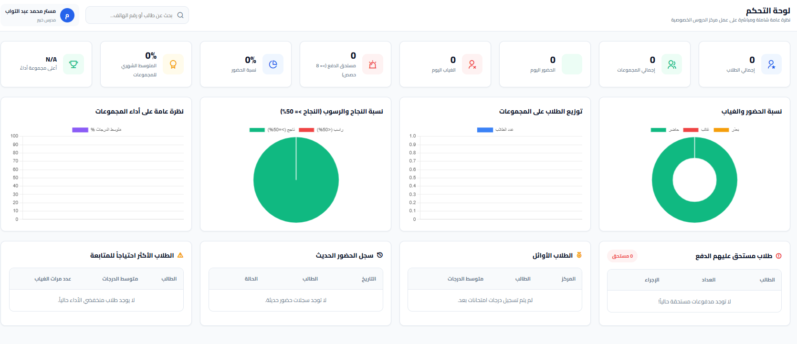
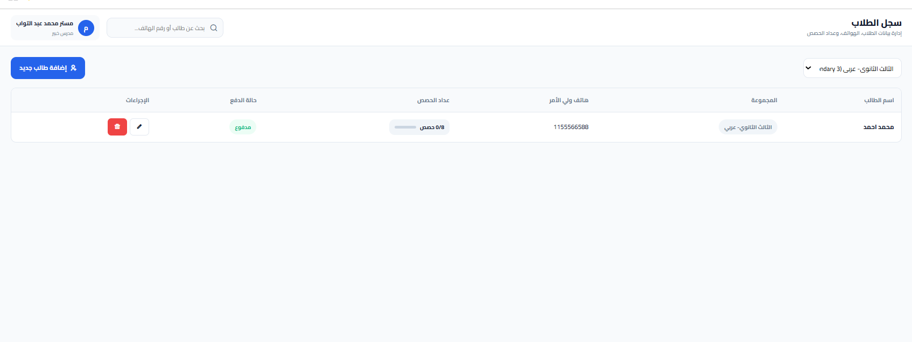
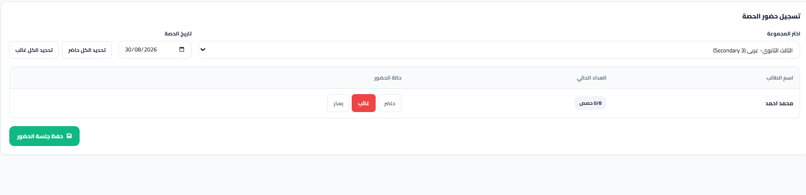
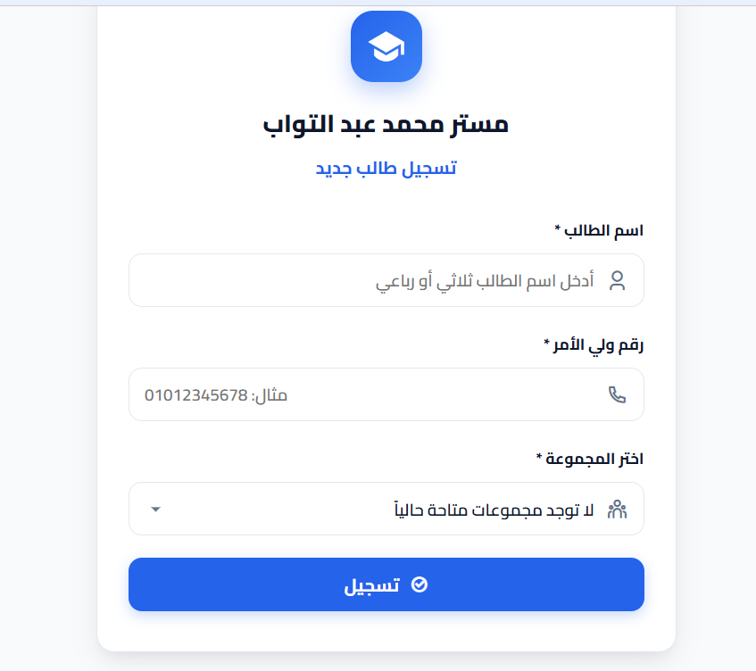

# Tutor / Student Management System

## Overview
A student management system built with Google Apps Script and Google Sheets to manage students, groups, attendance, exams, and reports.

## Tools & Technologies
- Google Apps Script
- Google Sheets
- HTML
- CSS
- JavaScript

## Features
- Student Management
- Group Management
- Attendance Tracking
- Exam Management
- Reports
- Student Self-Registration
- Dynamic Dashboard
- 8-Session Tracking

## Screenshots









## Project Structure

```text
Tutor-Student-Management-System
│
├── src
│   ├── Code.gs
│   ├── index.html
│   ├── style.html
│   └── script.html
│
├── screenshots
│   ├── dashboard.png
│   ├── students.png
│   ├── attendance.png
│   └── registration.png
│
└── README.md
